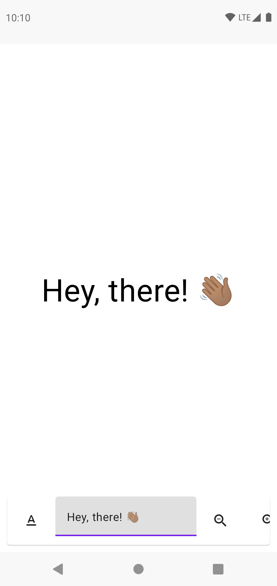
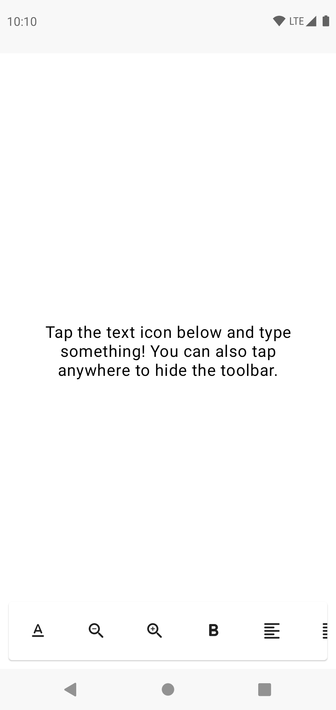

# Outdoor

    
    

Outdoor is simply a text displayer for Android. You can type anything you want and modify the text's size, boldness and alignment (start, justified, centered or end) for now. The toolbar gets hidden if you tap the screen, alongside the system UI. 